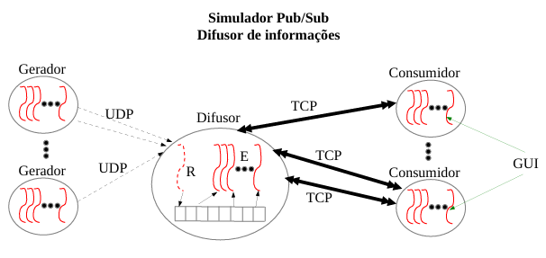

# TDE - Sockets & Threads

## 📖 Subject - Ubiquitous Computing: Clouds, Iot e Smart Environments

### 👨‍💻 Students
Bernardo Arcari Denkvitts <193317@upf.br>  
Pedro Marcelo Roso Manica <173722@upf.br>

## 🎯 Task goal
Develop a Pub/Sub simulator to send information to different consumers.



## 🚀 Technologies
* Python
* Sockets (UDP, TCP)
* Threads


## 🚩 Getting started

Clone the project

```bash
git clone https://github.com/BernardoDenkvitts/Trabalho_Sockets_Threads.git
```

To run the scripts, execute the following command:

Obs - There is no specific order to run the files

```bash
python -u file_name.py
```

## 🐍 Files .py

### <b>Consumer</b> (`consumidor.py`)

### Configuration

- **DIFUSOR_IP:** `'127.0.0.1'` (Diffuser IPV4 Address)
- **DIFUSOR_PORT:** `5555` (Diffuser Port)

### Connection attempts

If the diffuser is not connected at the time of consumer execution, it will try to connect randomly at defined intervals:

- **TENTATIVA_DORMIR_MIN:** `3` seconds
- **TENTATIVA_DORMIR_MAX:** `7` seconds

During the attempts, the consumer will "sleep" within this interval

### Listen

- **INTERVALO_ESCUTA:** `5` seconds (Indicates that the consumer is listening if the publisher has their threads inactive)

### Selecting informations
When executing the consumer, the type of information to be received will be requested. The information will be captured based on the input of an integer value through the keyboard. The available options are:

1. "Esporte"
2. "Novidades da Internet"
3. "Eletrônicos"
4. "Política"
5. "Negócios"
6. "Viagens"

---------------------------------
### <b>Generator</b> (`gerador.py`)

### Configuration

- **DIFUSOR_IP:** `'127.0.0.1'` (Diffuser IPV4 Address)
- **DIFUSOR_PORT:** `5000` (Diffuser Port)

### Message Intervals

After sending or trying to send a message, the gerador.py will "sleep" during an interval:
Após enviar ou tentar enviar uma mensagem, o gerador vai "dormir" por um intervalo definido:

- **DORMIR_MIN:** `1` seconds
- **DORMIR_MAX:** `7` seconds

### Geração de Valores

- **VALOR_MIN:** `1`
- **VALOR_MAX:** `100` (Intervalo para gerar números aleatórios).

### Closing the execution

Pressing `CTRL + C`, the gerador.py will finalize the threads responsible for generating messages before completely ending.

### Message types

The type of information/message generated by the generator is defined by the list `tipos_a_enviar = [1, 3]`, which supports the sending of one or more types. The available options are the same as the consumer:

1. "Esporte"
2. "Novidades da Internet"
3. "Eletrônicos"
4. "Política"
5. "Negócios"
6. "Viagens"

---------------------------------
### <b>Diffuser</b> (`difusor.py`)
The diffuser accepts consumer connections via IPV4 using port `5555` and uses port `5000` to communicate with generators.


